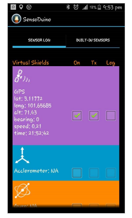

# Capstone Project

This project was done under the course Integrated Project Design in my third year together with 3 of my group mates. 

## Project Details

### Project Title
Development of Anti-Tailgating System (ATS) Equipped with Video Recording and Data Logging Functions

### Objective
1. To design an anti tailgating system with video recording and data logging function

### Hardware Selection
1. Raspberry Pi 3
2. Arduino UNO
3. Garmin LIDAR-Lite v3
4. Bluetooth module HC-05
5. Raspberry Pi Camera Module V1.3

### Softwares
1. Sensoduino (To detect the speed of own vehicle by taking the reading of the accelerometer in the phone)

### Project's Background
Tailgating can be defined as the act of driving on a road too close to the vehicle in front, such that the distance between the two vehicles does not guarantee that stopping to avoid collision is possible. In this project, we are interested in designing an anti-tailgating system with video recording and data logging functions. In order to perform the project, a distance sensor, LIDAR-Lite v3 from Garming was installed at the of the car to determine the distance the distance of the rear vehicle. Besdes, a Raspberry Pi camera module was installed at the rear dashboard to record video when the rear vehicle crossed the safety distance determined by the 1 second rule. In this project, the normally used 2 seconds rule was not used because of the limitation of our sensors. Furthermore, a phone application called "Sensoduino" was used to determine and send the speed of the car to Raspberry Pi. The speed is then used to calculate the speed of the rear vehicle by adding the relative speed which could be measured by the distance sensor. All of the interested data such as date, time, current distance between the two cars, speed of the rear vehicle and safety distance were logged into an Excel file for further analysis. In addition, a warning sign with the phrase, "TOO CLOSE" glowing in red color was used in this project to alert the rear vehicle's driver.

### Source code of the Project
The source code of this project can be access [here](https://github.com/marcushwz/capstone-project/blob/master/capstone.py)

### Schematic Diagram of the System

### Getting the system to work

1. Before putting the LIDAR-Lite 3 sensor onto the real car, calibration of the sensor is done.
#### Calibration of LIDAR-Lite v3

2. After the distance sensor had been calibrated, all the hardware were set up as shown in the schematic diagram above. Below are a few pictures showing the setup of the system before going for a test run.

#### LIDAR-Lite Sensor mounted at the back of the car

#### User Interface of Sensoduino (to measure the speed of the car)

#### Warning Sign at the Rear Dashboard

### Results
After everthing was set up following the schematic diagram, a few test runs had been done.

Here are a few videos showing the actual footage of the test runs:
1. In [this](https://www.youtube.com/watch?v=BXmaUCFwb60) video, the white car tend to stick very closely behind even at the corner.
2. In this [second](https://www.youtube.com/watch?v=jU64lMRZt8g) video, the black car was seem to react to the warning sign but slowing down its speed significantly.
3. The picture below shows one excel file containing the interested data of a certain test run. 

4. After getting the video footage and also the interested data, more analysis could be done such as studying the driving behavior of the drivers.

### Conclusion
In this project, our team was able to come out with a working prototype demonstrating the anti-tailgating system with video recording and data logging function. However, everything we had done here was for academic purposes, and there are a lot of improvements that could be done!

